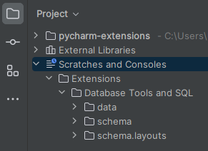
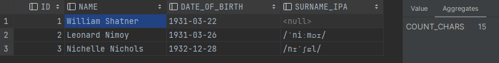
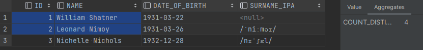
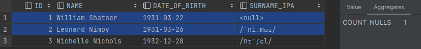
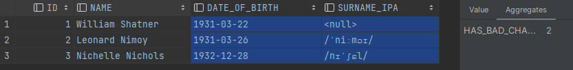
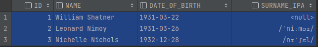
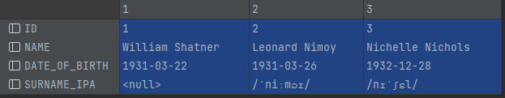
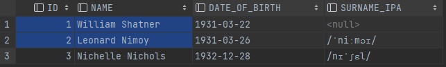

Custom PyCharm Database Extensions
---
[PyCharm Professional](https://www.jetbrains.com/pycharm) ships with some `.groovy` scripts as database extensions. This repo adds additional ones to these (mainly just tweaking the existing scripts!).

> The official documentation for PyCharm's database extensions can be found at:
> 
> - https://www.jetbrains.com/help/pycharm/relational-databases.html
> 
> The aggregators and extractors are documented, respectively, at:
> - https://www.jetbrains.com/help/pycharm/table-editor.html#aggregate-view
> - https://www.jetbrains.com/help/pycharm/data-extractors.html


### Where are the database extensions?

In the project view, you can find the database extensions under **Scratches and Consoles**:

<div style="text-align: center;">



</div>

New scripts can be added here directly and will automatically be available in the IDE -- across all projects!


### Where are the database extensions used?

Please refer to the official aggregator and extractor documentation:
- https://www.jetbrains.com/help/pycharm/table-editor.html#aggregate-view
- https://www.jetbrains.com/help/pycharm/data-extractors.html


# Custom Extensions

This repo adds the following extensions:

- **Aggregators**
  - [COUNT_CHARS.groovy](data/aggregators/COUNT_CHARS.groovy)
  - [COUNT_DISTINCT.groovy](data/aggregators/COUNT_DISTINCT.groovy)
  - [COUNT_NULLS.groovy](data/aggregators/COUNT_NULLS.groovy)
  - [HAS_BAD_CHARS.groovy](data/aggregators/HAS_BAD_CHARS.groovy)
- **Extractors**
  - [Jira-Server.md.groovy](data/extractors/Jira-Server.md.groovy)
  - [One-Row.sql.groovy](data/extractors/One-Row.sql.groovy)
  - [SQL-Where.sql.groovy](data/extractors/SQL-Where.sql.groovy)

Details will be added below with the following example table:

|  id | name             | date_of_birth | surname_ipa                              |
|----:|:-----------------|:--------------|:-----------------------------------------|
|   1 | William Shatner  | 1931-03-22    | <span style="color:grey">\<null\></span> |
|   2 | Leonard Nimoy    | 1931-03-26    | /ˈniːmɔɪ/                                |
|   3 | Nichelle Nichols | 1932-12-28    | /nɪˈʃɛl/                                 |


## Database Aggregators

### [COUNT_CHARS.groovy](data/aggregators/COUNT_CHARS.groovy)

Count the total number of characters across the selection. Intended to be used on a single cell at a time to quickly determine the length of its contents, but can be used on many cells to get the total number of characters over them.




### [COUNT_DISTINCT.groovy](data/aggregators/COUNT_DISTINCT.groovy)

Count the number of distinct cells in the selection. Note that null values are not ignored and will count as a distinct value.




### [COUNT_NULLS.groovy](data/aggregators/COUNT_NULLS.groovy)

Count the number of cells that have a null value.




### [HAS_BAD_CHARS.groovy](data/aggregators/HAS_BAD_CHARS.groovy)

Count the number of cells (not the number of characters) that have at least one "bad character". As an English speaker, a "good character" is any character between a space (` `, U+0020) and a tilde (`~`, U+0126) on the ASCII/unicode scale, and a "bad character" is any character that is not a "good character". Null values are not counted (but the null character, U+0000, is).




## Database Extractors

### [Jira-Server.md.groovy](data/extractors/Jira-Server.md.groovy)

Format the cells appropriately for Jira Server. This is a modified version of the Markdown-Groovy extractor, but tweaked to return Atlassian server's wiki markup instead of Markdown.

Like the build-in Markdown extractor, this has different outputs depending on whether the result set is transposed or not.

#### Default

Copy:



Paste:
```
|| ID || NAME || DATE_OF_BIRTH || SURNAME_IPA ||
| 1 | William Shatner | 1931-03-22 | null |
| 2 | Leonard Nimoy | 1931-03-26 | /ˈniːmɔɪ/ |
| 3 | Nichelle Nichols | 1932-12-28 | /nɪˈʃɛl/ |
```

#### Transposed

Copy:



Paste:
```
|| || || || |
| ID | 1 | 2 | 3 |
| NAME | William Shatner | Leonard Nimoy | Nichelle Nichols |
| DATE_OF_BIRTH | 1931-03-22 | 1931-03-26 | 1932-12-28 |
| SURNAME_IPA | null | /ˈniːmɔɪ/ | /nɪˈʃɛl/ |
```


### [One-Row.sql.groovy](data/extractors/One-Row.sql.groovy)

Simply join the selected cells (values only) using a comma and space as a separator, quoting the values if needed. Handy for copying values to put inside an `IN` statement.

Copy:



Paste:
```
1, 'William Shatner', 2, 'Leonard Nimoy'
```


### [SQL-Where.sql.groovy](data/extractors/SQL-Where.sql.groovy)

Join the selected cells' values with the column names ready to be pasted into a `WHERE` clause. Intended to be used for a single row at a time, but can be used on many.

Copy:


Paste:
```
WHERE 1=1
AND id = 1
AND name = 'William Shatner'
AND id = 2
AND name = 'Leonard Nimoy'
```
